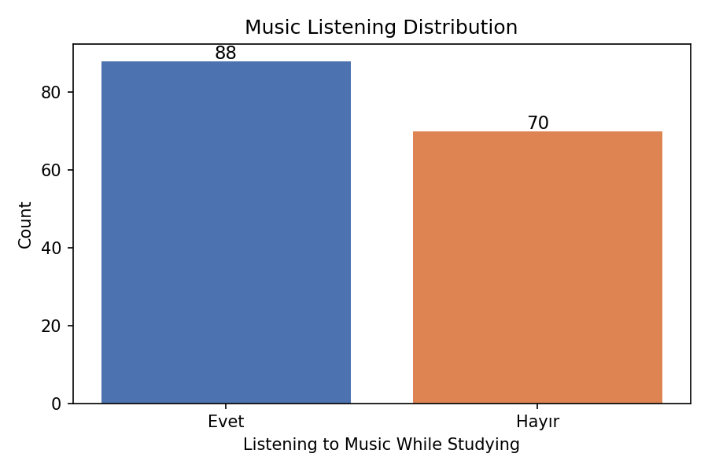
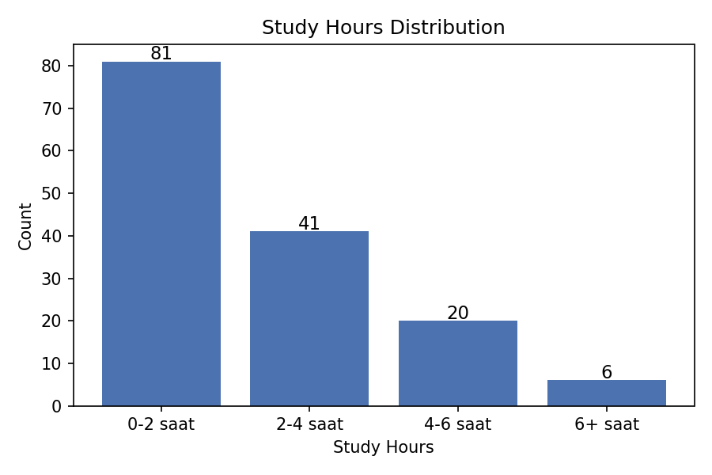
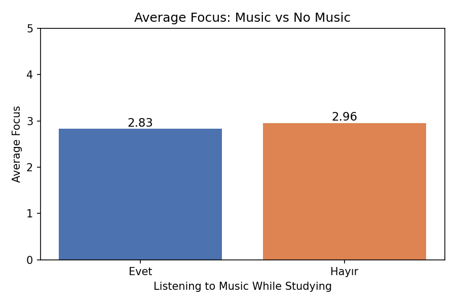
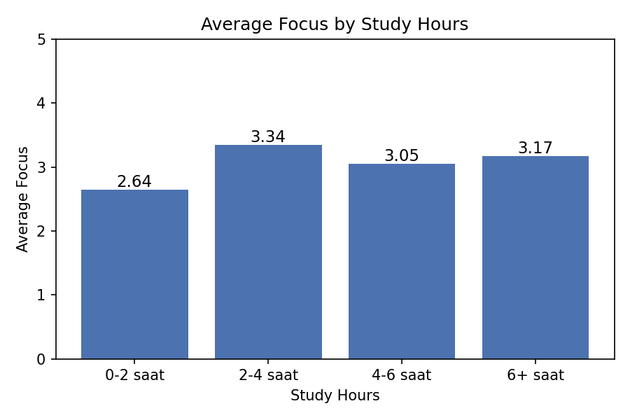
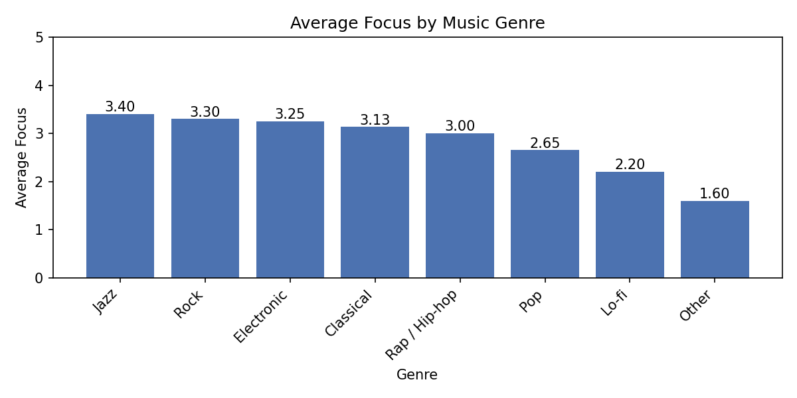
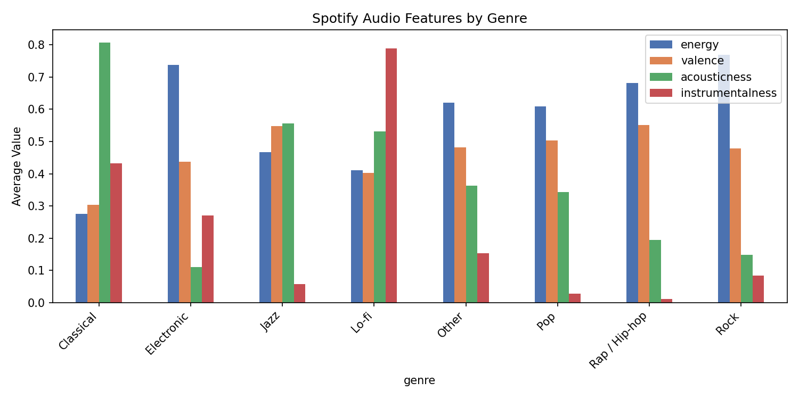
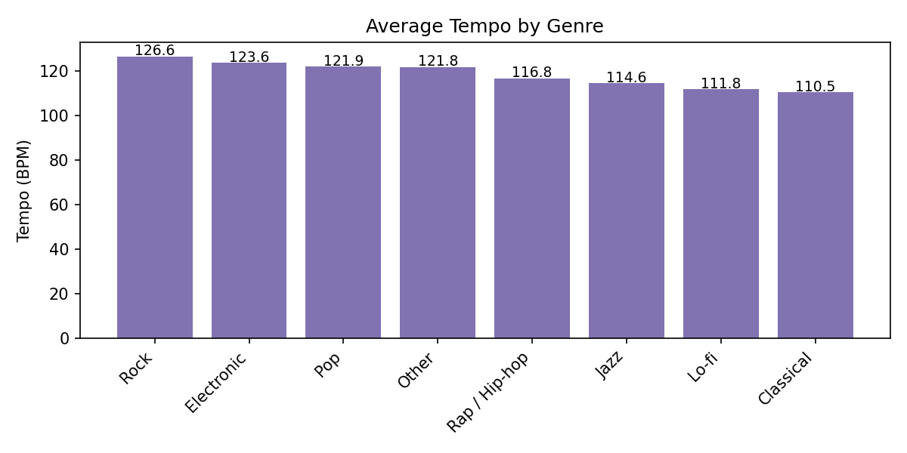

# Music Listening and Its Relationship with University Students' Study Habits and Productivity

**DSA 210 – Introduction to Data Science | Spring 2025–2026**

---

## Motivation

This project investigates whether and how music listening habits affect university students' study productivity, specifically in terms of **focus levels** (self-reported, 1–5 scale) and **daily study duration**. Survey data collected from university students is enriched with Spotify audio feature data to explore whether the *acoustic properties* of preferred genres are associated with focus levels.

---

## Repository Structure

```
.
├── README.md
├── requirements.txt
├── survey.csv              # Primary data: student survey responses (n=148)
├── dataset.csv             # Enrichment data: Spotify track audio features (n=114,000)
└── analysis.py             # Main analysis script (EDA + hypothesis tests)
```

---

## Data Sources

### 1. Student Survey (Primary Data)

Collected via an online survey distributed to university students. The survey includes:

| Column | Description | Type |
|---|---|---|
| `study_hours` | Daily study duration (categorical) | Ordinal: 0–2 h / 2–4 h / 4–6 h / 6+ h |
| `focus` | Self-reported focus level while studying | Integer: 1 (low) – 5 (high) |
| `music` | Whether they listen to music while studying | Binary: Evet (Yes) / Hayır (No) |
| `genre_tr` | Preferred music genre (Turkish labels) | Categorical |

**Final sample after cleaning:** 148 responses (82 music listeners, 66 non-listeners).

### 2. Spotify Dataset (Enrichment Data)

A publicly available Spotify tracks dataset containing 114,000 songs with audio features per genre. Used to extract mean acoustic profiles for each genre category.

| Feature | Description |
|---|---|
| `energy` | Intensity and activity (0–1) |
| `danceability` | Rhythmic suitability for dancing (0–1) |
| `tempo` | Estimated beats per minute |
| `valence` | Musical positiveness (0–1) |
| `acousticness` | Acoustic vs. electronic (0–1) |
| `instrumentalness` | Absence of vocals (0–1) |

---

## Setup & Reproduction

### Requirements

```bash
pip install -r requirements.txt
```

**requirements.txt:**
```
pandas
numpy
matplotlib
scipy
```

### Running the Analysis

```bash
python analysis.py
```

This will print all EDA summaries and hypothesis test results to the console, and display all plots sequentially.

> Make sure `survey.csv` and `dataset.csv` are in the same directory as `analysis.py`.

---

## Data Cleaning Steps

1. **Survey columns** renamed and timestamp dropped.
2. **Focus** converted to numeric; rows with missing focus values dropped.
3. **Genre labels** standardized from Turkish free-text into 7 canonical categories: Classical, Lo-fi, Jazz, Pop, Rap / Hip-hop, Rock, Electronic (+ Other).
4. **Study hours** encoded as an ordered categorical variable; a numeric midpoint version (`study_hours_num`) created for correlation analysis.
5. **Spotify genres** mapped to the same 7 categories; Spotify's `study` genre is mapped to Lo-fi as they represent the same acoustic context. Mean audio features aggregated per genre.
6. **Merge:** Music-listener rows in the survey are joined with Spotify group averages on the `genre` key.

---

## Exploratory Data Analysis

### Music Listening Distribution



### Study Hours Distribution



### Average Focus: Music vs No Music



### Average Focus by Study Hours



### Average Focus by Genre (Music Listeners Only)



### Spotify Audio Features by Genre



### Average Tempo by Genre



---

## Hypothesis Tests

All tests use **α = 0.05**.

### H1 — Music Listening vs No Music on Focus

- **Test:** Independent samples t-test
- **H₀:** Mean focus is equal for music listeners and non-listeners.
- **Result:** t = −0.4125, p = 0.6806
- **Conclusion:** Fail to reject H₀. No statistically significant difference in focus between the two groups.

---

### H2 — Genre vs Focus

- **Test:** One-way ANOVA across genre groups (music listeners only)
- **H₀:** Mean focus is equal across all genres.
- **Result:** F = 2.2778, p = 0.0371
- **Conclusion:** Reject H₀. Focus differs significantly across genres. Jazz, Rock, and Classical listeners report the highest focus; Lo-fi and Other the lowest.

---

### H3 — Study Duration vs Focus

- **Test:** One-way ANOVA across study-hour groups
- **H₀:** Mean focus is equal across all study-duration groups.
- **Result:** F = 4.0291, p = 0.0087
- **Conclusion:** Reject H₀. Students who study longer report significantly higher focus levels.

---

### H4 — Spotify Audio Features vs Focus

- **Test:** Pearson correlation (per feature, music listeners only)
- **H₀:** No linear correlation between audio feature and focus.

| Feature | r | p-value | Significant? |
|---|---|---|---|
| energy | −0.0007 | 0.9951 | No |
| danceability | −0.1024 | 0.3597 | No |
| tempo | −0.0355 | 0.7513 | No |
| valence | −0.0356 | 0.7507 | No |
| acousticness | +0.0038 | 0.9727 | No |
| instrumentalness | −0.0624 | 0.5773 | No |

- **Conclusion:** Fail to reject H₀ for all features. No statistically significant linear correlation found between any Spotify audio feature and self-reported focus.

---

### H5 — Music Listening vs Study Duration

- **Test:** Chi-square test of independence
- **H₀:** Music listening habit and study duration category are independent.
- **Result:** χ² = 1.9674, p = 0.5792, df = 3
- **Conclusion:** Fail to reject H₀. No significant association between listening to music and how long students study.

---

### Summary of Hypothesis Tests

| # | Question | Test | Statistic | p-value | Result |
|---|---|---|---|---|---|
| H1 | Music → Focus | t-test | t = −0.41 | 0.681 | Not significant |
| H2 | Genre → Focus | One-way ANOVA | F = 2.28 | **0.037** | **Significant** |
| H3 | Study hours → Focus | One-way ANOVA | F = 4.03 | **0.009** | **Significant** |
| H4 | Audio features → Focus | Pearson r | — | > 0.36 (all) | Not significant |
| H5 | Music → Study hours | Chi-square | χ² = 1.97 | 0.579 | Not significant |

---

## Key Findings

1. **Listening to music itself does not significantly affect focus.** Whether a student listens to music or not has no measurable impact on self-reported focus levels (H1, H5).
2. **Music genre matters.** The type of music listened to is significantly associated with focus levels (H2, p = 0.037). Jazz, Rock, and Classical listeners report the highest focus; Lo-fi and Other the lowest.
3. **Study duration is the strongest predictor of focus.** Students who study longer report significantly higher focus — though this is correlational, not causal (H3, p = 0.009).
4. **Acoustic properties of genres do not directly predict focus.** Despite genre being significant, no individual Spotify audio feature shows a significant linear correlation with focus among listeners (H4). The genre effect may be driven by individual preferences or study context rather than raw acoustic properties.

---

## Limitations & Future Work

- **Sample size:** 148 responses is sufficient for preliminary analysis but limits the power of subgroup tests (e.g., genre groups with n < 10).
- **Self-reported focus:** Focus is subjective and measured with a coarse 1–5 scale; objective measures (e.g., task performance, eye-tracking) would be more reliable.
- **Causality:** All findings are correlational. Experimental designs (e.g., randomly assigning music conditions) would be needed to establish causal effects.
- **Future work:** Apply machine learning models (e.g., ordinal logistic regression, random forests) to predict focus from combined survey + audio feature inputs; collect longitudinal data tracking the same students across multiple sessions.

---

## Academic Integrity

AI tools (Claude, ChatGPT) were used to assist with code writing, statistical interpretation, and README writing. All prompts and outputs were reviewed and verified by the student.
