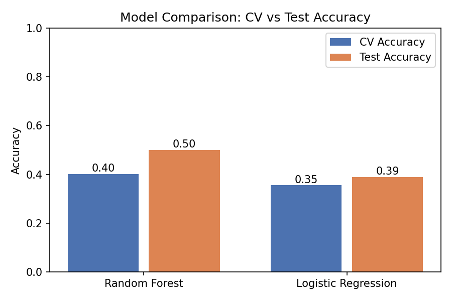
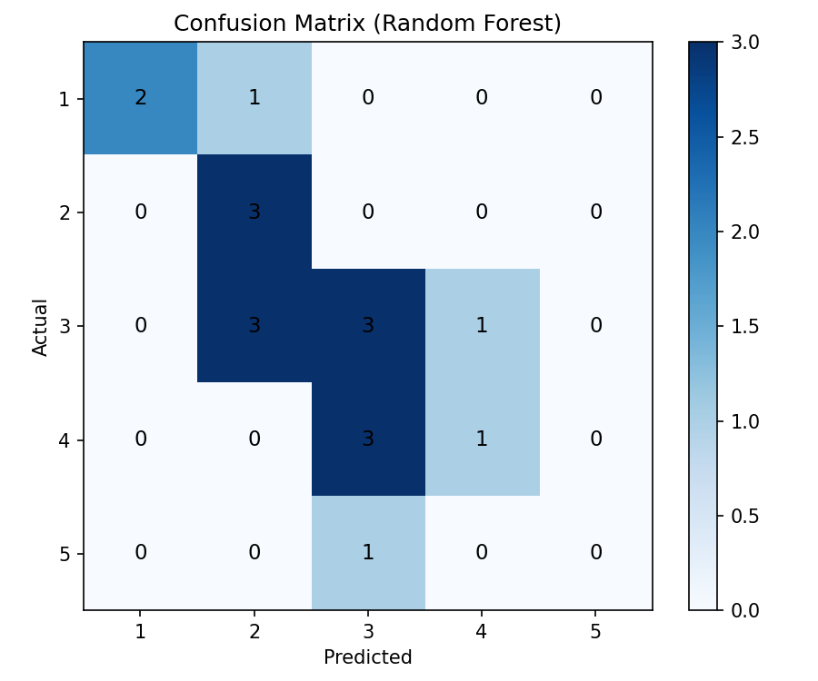
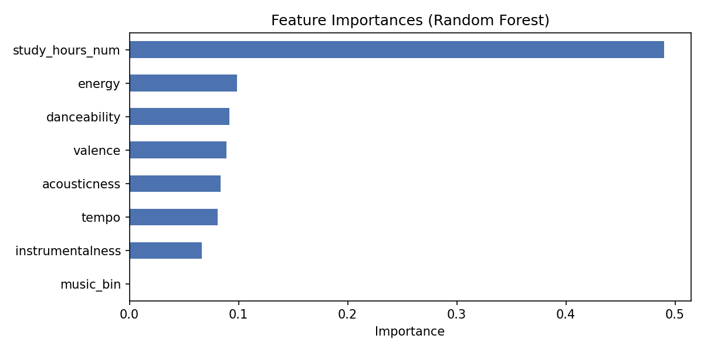
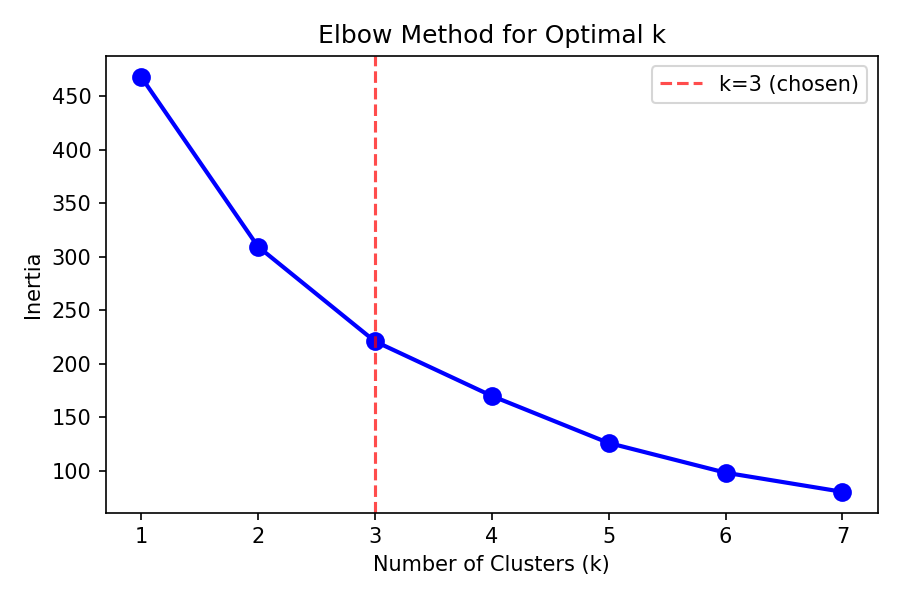
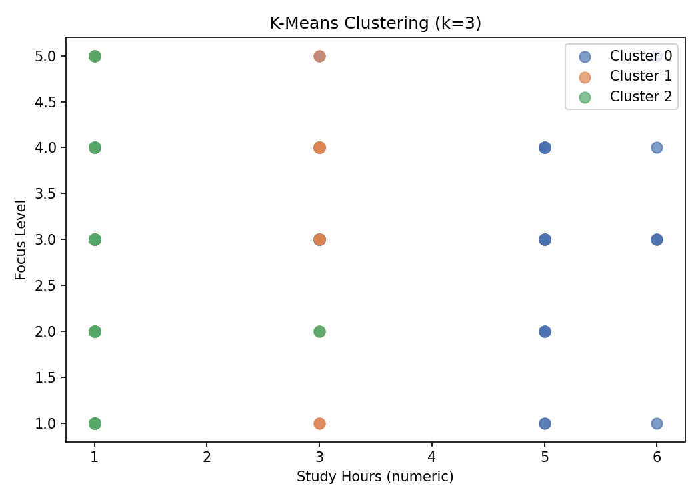

# Music Listening and Its Relationship with University Students' Study Habits and Productivity

**DSA 210 – Introduction to Data Science | Spring 2025–2026**

---

## Motivation

This project investigates whether and how music listening habits affect university students' study productivity, specifically in terms of **focus levels** (self-reported, 1–5 scale) and **daily study duration**. Survey data collected from university students is enriched with Spotify audio feature data to explore whether the *acoustic properties* of preferred genres are associated with focus levels.

---

## Repository Structure

```
.
├── README.md
├── requirements.txt
├── survey.csv              # Primary data: student survey responses (n=158)
├── dataset.csv             # Enrichment data: Spotify track audio features (n=114,000)
├── analysis.py             # EDA + hypothesis tests
└── ml.py                   # Machine learning: classification + clustering
```

---

## Data Sources

### 1. Student Survey (Primary Data)

Collected via an online survey distributed to university students. The survey includes:

| Column | Description | Type |
|---|---|---|
| `study_hours` | Daily study duration (categorical) | Ordinal: 0–2 h / 2–4 h / 4–6 h / 6+ h |
| `focus` | Self-reported focus level while studying | Integer: 1 (low) – 5 (high) |
| `music` | Whether they listen to music while studying | Binary: Evet (Yes) / Hayır (No) |
| `genre_tr` | Preferred music genre (Turkish labels) | Categorical |

**Final sample after cleaning:** 158 responses.

### 2. Spotify Dataset (Enrichment Data)

A publicly available Spotify tracks dataset containing 114,000 songs with audio features per genre. Used to extract mean acoustic profiles for each genre category.

| Feature | Description |
|---|---|
| `energy` | Intensity and activity (0–1) |
| `danceability` | Rhythmic suitability for dancing (0–1) |
| `tempo` | Estimated beats per minute |
| `valence` | Musical positiveness (0–1) |
| `acousticness` | Acoustic vs. electronic (0–1) |
| `instrumentalness` | Absence of vocals (0–1) |

---

## Setup & Reproduction

### Requirements

```bash
pip install -r requirements.txt
```

**requirements.txt:**
```
pandas
numpy
matplotlib
scipy
scikit-learn
```

### Running the Analysis

```bash
# EDA and hypothesis tests
python analysis.py

# Machine learning
python ml.py
```

> Make sure `survey.csv` and `dataset.csv` are in the same directory.

---

## Data Cleaning Steps

1. **Survey columns** renamed and timestamp dropped.
2. **Focus** converted to numeric; rows with missing focus values dropped.
3. **Genre labels** standardized from Turkish free-text into 7 canonical categories: Classical, Lo-fi, Jazz, Pop, Rap / Hip-hop, Rock, Electronic (+ Other).
4. **Study hours** mapped to numeric midpoints for ML use.
5. **Spotify genres** mapped to the same 7 categories; Spotify's `study` genre mapped to Lo-fi.
6. **Merge:** Survey rows joined with Spotify group averages on the `genre` key.

---

## Exploratory Data Analysis

### Music Listening Distribution


### Study Hours Distribution


### Average Focus: Music vs No Music


### Average Focus by Study Hours


### Average Focus by Genre (Music Listeners Only)


### Spotify Audio Features by Genre


### Average Tempo by Genre


---

## Hypothesis Tests

All tests use **α = 0.05**.

### Summary of Hypothesis Tests

| # | Question | Test | Statistic | p-value | Result |
|---|---|---|---|---|---|
| H1 | Music → Focus | t-test | t = −0.41 | 0.681 | Not significant |
| H2 | Genre → Focus | One-way ANOVA | F = 2.28 | **0.037** | **Significant** |
| H3 | Study hours → Focus | One-way ANOVA | F = 4.03 | **0.009** | **Significant** |
| H4 | Audio features → Focus | Pearson r | — | > 0.36 (all) | Not significant |
| H5 | Music → Study hours | Chi-square | χ² = 1.97 | 0.579 | Not significant |

### H1 — Music Listening vs No Music on Focus

- **Test:** Independent samples t-test
- **Result:** t = −0.4125, p = 0.6806
- **Conclusion:** Fail to reject H₀. No significant difference in focus between music listeners and non-listeners.

### H2 — Genre vs Focus

- **Test:** One-way ANOVA
- **Result:** F = 2.2778, p = 0.0371
- **Conclusion:** Reject H₀. Jazz, Rock, and Classical listeners report the highest focus; Lo-fi and Other the lowest.

### H3 — Study Duration vs Focus

- **Test:** One-way ANOVA
- **Result:** F = 4.0291, p = 0.0087
- **Conclusion:** Reject H₀. Students who study longer report significantly higher focus.

### H4 — Spotify Audio Features vs Focus

- **Test:** Pearson correlation per feature
- **Result:** No feature showed a significant correlation (all p > 0.36).
- **Conclusion:** Fail to reject H₀ for all features.

### H5 — Music Listening vs Study Duration

- **Test:** Chi-square test of independence
- **Result:** χ² = 1.9674, p = 0.5792
- **Conclusion:** Fail to reject H₀. No significant association between music listening and study duration.

---

## Machine Learning

### Features Used

| Feature | Description |
|---|---|
| `study_hours_num` | Numeric study duration |
| `music_bin` | Whether the student listens to music (0/1) |
| `energy` | Spotify audio feature |
| `danceability` | Spotify audio feature |
| `tempo` | Spotify audio feature |
| `valence` | Spotify audio feature |
| `acousticness` | Spotify audio feature |
| `instrumentalness` | Spotify audio feature |

Only music listeners with matched Spotify features were used (n=87 after merging and dropping NaNs).

---

### Classification: Predicting Focus Level

Two classifiers were trained to predict the focus level (1–5) of a student.

#### Model Comparison



| Model | CV Accuracy | Test Accuracy |
|---|---|---|
| Random Forest | 0.40 | 0.50 |
| Logistic Regression | 0.35 | 0.39 |

Random Forest outperforms Logistic Regression on both CV and test accuracy. The relatively low accuracy reflects the difficulty of predicting a 5-class ordinal target from a small dataset.

#### Confusion Matrix (Random Forest)



#### Feature Importances



`study_hours_num` is by far the most important feature (importance ≈ 0.49), consistent with the H3 hypothesis test result. Spotify audio features contribute moderately. `music_bin` has near-zero importance, consistent with H1.

| Feature | Importance |
|---|---|
| study_hours_num | 0.4900 |
| energy | 0.0988 |
| danceability | 0.0918 |
| valence | 0.0892 |
| acousticness | 0.0833 |
| tempo | 0.0807 |
| instrumentalness | 0.0662 |
| music_bin | 0.0000 |

---

### Clustering: Student Profiles (K-Means)

K-Means clustering was applied to group students by study behavior using `study_hours_num`, `music_bin`, and `focus`.

#### Elbow Method



The elbow plot suggests k=3 as a reasonable choice.

#### Cluster Scatter Plot



#### Cluster Profiles

| Cluster | Study Hours | Listens to Music | Avg Focus | Profile |
|---|---|---|---|---|
| 0 | 4.22 | 82% | 3.18 | High study, mixed music, high focus |
| 1 | 1.57 | 0% | 3.02 | Low study, no music, moderate focus |
| 2 | 1.09 | 100% | 2.45 | Low study, always music, low focus |

Three distinct student profiles emerge: students who study a lot regardless of music (Cluster 0), students who study little without music (Cluster 1), and students who study little but always with music and have the lowest focus (Cluster 2).

---

## Key Findings

1. **Listening to music itself does not significantly affect focus** (H1, H5). Whether a student listens to music or not has no measurable impact on focus levels.
2. **Music genre matters** (H2, p = 0.037). Jazz, Rock, and Classical listeners report the highest focus; Lo-fi and Other the lowest.
3. **Study duration is the strongest predictor of focus** (H3, p = 0.009; RF importance = 0.49). Students who study longer report significantly higher focus.
4. **Acoustic properties of genres do not directly predict focus** (H4). No individual Spotify audio feature showed a significant linear correlation with focus.
5. **Clustering reveals three student profiles**: high-study mixed-music students (best focus), low-study no-music students (moderate focus), and low-study music-always students (lowest focus).

---

## Limitations & Future Work

- **Sample size:** 158 total responses; only 87 usable for ML after merging with Spotify features. Larger samples would improve model performance.
- **Self-reported focus:** Subjective 1–5 scale; objective measures would be more reliable.
- **Causality:** All findings are correlational.
- **Class imbalance:** Focus class 3 dominates (n=59), which may bias classifiers.

---

## Academic Integrity

AI tools (Claude, ChatGPT) were used to assist with code writing, statistical interpretation, and README writing. All prompts and outputs were reviewed and verified by the student.
